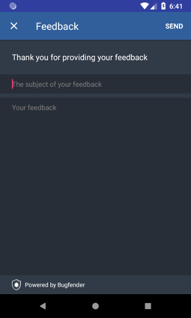
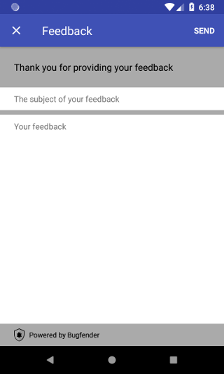

# Bugfender Android SDK

[](http://www.javadoc.io/doc/com.bugfender.sdk/android)

## SDK Installation
Here are the main points to getting Bugfender working on your apps:

* Get an app key at [bugfender.com](https://bugfender.com/)
* Add Bugfender SDK dependency to your module `<module>/build.gradle`: `implementation 'com.bugfender.sdk:android:3.+'` (or the most recent version of the SDK)
* Initialize Bugfender in your `Application#onCreate()` with:

```java
Bugfender.init(this, "<YOUR APP KEY>", BuildConfig.DEBUG);
Bugfender.enableLogcatLogging();
Bugfender.enableUIEventLogging(this);
```

* If using Proguard, you do not need to change your configuration. Bugfender is compatible out of the box.
* If you detect an issue, you can send it calling `Bugfender.sendIssue("Title", "Message");`
* If you want to associate a value (String, Integer, Boolean or Float) to a device, you can send it with (learn more about [Device associated data] (https://bugfender.com/blog/associated-device-information)):
  - `Bugfender.setDeviceString("user.email", "john@john.com");`
  - `Bugfender.setDeviceInteger("user.photo.image.width", 600);`
  - `Bugfender.setDeviceBoolean("user.is.logged", true);`
  - `Bugfender.setDeviceFloat("user.children", 3f);`
* If you want to remove a specific value associated with the device, you can do it with: `Bugfender.removeDeviceKey("user.children");`
* Bugfender automatically generates an identifier for the application install in a device. You can retrieve it to show in your UI or send it to your server: `Bugfender.getDeviceIdentifier();`

This repository contains a sample application using Bugfender.

## Collecting User feedback

Getting feedback from the final users is one of the most important things for an app developer. Good user feedback allows you detect errors in your app and helps you to understand better your product.

Starting from version 1.1, Bugfender provides a new feature to easily collect app feedback from final users. It takes only two minutes and a few lines of code to integrate. You can think about the User Feedback as an special kind of Issue, every time your users submit their feedback you will get a new issue in Bugfender.



The easiest way to implement Bugfender User Feedback is using the customizable User Feedback Activity. It provides a convenient screen with two text fields, one short for the subject and another bigger for the feedback.

### Using default UI

Using the convenient UI provided by Bugfender requires calling the following method that will return the Intent that must be used to start the Activity:
```java
// Obtaining the Intent
Intent userFeedbackIntent = Bugfender.getUserFeedbackActivityIntent (
                                                        context,
                                                        "App bar title",
                                                        "Give some instructions to your users",
                                                        "Placeholder for subject textfield" ,
                                                        "Placeholder for message textfield",
                                                        "Send")


// Starting the Activity
startActivityForResult (userFeedbackIntent, YOUR_REQUEST_CODE);
```
You can obtain information about the user action (if feedback was sent and the URL on Bugfender dashboard) using the onActivityResult method:
```java
@Override
protected void onActivityResult (final int requestCode, final int resultCode, final Intent data) {
  if (requestCode == YOUR_REQUEST_CODE) {
    Toast.makeText (this, resultCode == Activity.RESULT_OK ? "Feedback sent" : "Feedback cancelled", Toast.LENGTH_SHORT).show ();
    if (resultCode == Activity.RESULT_OK) {
	    String url = data.getStringExtra ("result.feedback.url");
    }
  } else {
    super.onActivityResult (requestCode, resultCode, data);
  }
}
```
Additionally, if you require more customization you can configure the colors of the screen calling a version of `Bugfender.getUserFeedbackActivityIntent` method that accepts a `FeedbackStyle` object as an additional argument. With this object you can configure three areas of the screen separately (app bar, input and rest of the screen), the areas that are not set will use the colors provided by our default implementation.
```java
FeedbackStyle feedbackStyle = new FeedbackStyle ()
    .setAppBarColors (R.color.backgroundColor, R.color.titleColor, R.color.closeButtonColor, R.color.actionButtonColor)
    .setInputColors (R.color.backgroundColor, R.color.textColor, R.color.hintColor)
    .setScreenColors (R.color.backgroundColor, R.color.textColor)
```


### Using a custom UI

If you need further customization you can implement your own UI. All you have to do is collect your user feedback as you wish and send it to Bugfender using `Bugfender.sendUserFeedback`:

```java
Bugfender.sendUserFeedback ("Title of the feedback", "Message of the feedback")
```

## More information
### Docs
For more information on all methods available, please go to the [Bugfender Android reference documentation](http://www.javadoc.io/doc/com.bugfender.sdk/android).

### SDK status
The SDK is suitable for production. Please feel free to open an issue or contact us at [bugfender.com](https://bugfender.com) .
